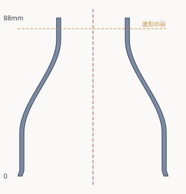
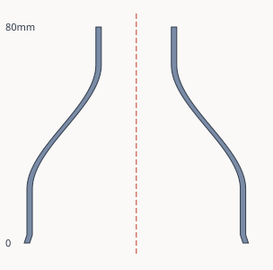

# ハンディファン用 風集めノズル（集風器）

ハンディファンの頭にかぶせて、広がってしまう風を一箇所に絞って飛ばすアタッチメント。
3Dプリンタ用の STL と、寸法を変えて作り直せる生成スクリプトが入っている。

## 先に知っておくこと：絞ると必ずうるさくなる

噴流の騒音は **出口の風速のおよそ 5〜6 乗** で効く。風を絞るというのは風速を上げる
ことなので、「ノズルを付けたら素のファンより静かになる」というのは原理的に起きない。
できるのは **絞りつつ、音のペナルティをできるだけ小さくすること**。

音に効く要素を、効き目の大きい順に並べるとこうなる。

| 順 | 要素 | どうするか |
| --- | --- | --- |
| 1 | **出口の内径** | 大きくする。ここだけでほぼ決まる |
| 2 | **出口の縁の形** | 波形（シェブロン）にして、外の空気と一気にぶつからないようにする |
| 3 | **絞りのなだらかさ** | 長くとって壁の傾きをゆるくし、内壁で流れがはがれないようにする |
| 4 | **えりの深さ** | 深くして、羽根と絞りの入口を離す |
| 5 | **壁の鳴き・すきま風** | 肉厚を増やす、えりの内側にスポンジテープを貼る |
| — | 整流フィン | **静かさ優先なら付けない**。羽根との組み合わせで音程のある音が出ることがある |

静音版はこの 1〜5 を全部入れてある。

## ファイル

| ファイル | 中身 |
| --- | --- |
| `rhythm-fan-nozzle-quiet.stl` | **静音版**。まずはこれを勧める |
| `rhythm-fan-nozzle.stl` | 標準版。とにかく遠くに飛ばしたいとき |
| `rhythm-fan-nozzle-vanes.stl` | 標準版＋十字の整流フィン。風のまとまり優先 |
| `fan_nozzle.py` | STL を作り直すスクリプト（Python 3 標準ライブラリのみ、依存なし） |
| `cross-section-quiet.svg` / `cross-section.svg` | それぞれの断面図 |

### 静音版（`-quiet`）



| 項目 | 値 |
| --- | --- |
| 全高 | 88.0 mm |
| 最大外径 | 82.0 mm |
| 差しこみ口の内径 | 77.2 mm |
| えりの深さ | 24 mm |
| 吹き出し口の内径 | 36 mm |
| 出口の波形 | 12 山 / 深さ 6 mm |
| 肉厚 | 2.4 mm |
| 断面の絞り比 | 約 4.5 倍 |

出口の波形は、ジェットエンジンのノズル後端のギザギザと同じ考えかた。出口の速い空気と
まわりの止まった空気が一直線の縁で一気にぶつかると、耳につく低めの「ゴー」が出る。
縁を波打たせると混ざりかたが段階的になり、音が小さく、かつ高い周波数寄りになって
気になりにくくなる。とがった三角は印刷すると薄い先端が欠けやすいので、なめらかな波にしてある。

### 標準版



全高 80.0 mm ／ 最大外径 81.2 mm ／ えりの深さ 20 mm ／ 吹き出し口 26 mm ／
肉厚 2.0 mm ／ 絞り比 約 8.5 倍。

## 出口の内径をいくつにするか

音と飛びのトレードオフはここで決まる。相対値はどれも 26 mm を 1.00 とした目安で、
**実測値ではなく計算上の値**。しかもファン本体のモーター音・羽根の音は変わらないので、
実際に耳で感じる差はこの表より小さくなる。

| 出口の内径 | 絞り比 | 出口の風速（相対） | 噴流の騒音（相対・目安） |
| --- | --- | --- | --- |
| 26 mm（標準版） | 8.5 倍 | 1.00 | 1.00 |
| 30 mm | 6.4 倍 | 0.75 | 約 0.2 |
| **36 mm（静音版）** | **4.5 倍** | **0.52** | **約 0.03** |
| 42 mm | 3.3 倍 | 0.38 | 約 0.01 |

絞りすぎるとファンが風を押し出せなくなり、風量が落ちるうえに羽根がうなって
かえってうるさくなる。36 mm はその手前をねらった値。

## 印刷の設定

- **置きかた**: 差しこみ口（太いほう）を下にして、吹き出し口を上に向ける
- **サポート**: 不要。壁の傾きは静音版で垂直から約 31°、標準版で約 40° なので自立する
- **ブリム**: 推奨。底の接地が細いリングだけなので、はがれ防止に
- **積層ピッチ**: 0.2 mm
- **外周**: 3 周以上（壁を厚く詰めるほど鳴きにくい）／**充填**: 15 % 程度
- **材料**: PLA でも作れるが、夏の車内や直射日光で変形しやすい。**PETG 推奨**

## さらに静かにするなら

- **えりの内側に薄いスポンジテープを一周貼る。** すきま風の「ヒュー」が消えるうえ、
  ファンの振動がノズルに伝わって壁が鳴るのも減る。はめ具合の調整も兼ねられる
- **出口を手や布でふさがない。** 塞ぐとファンに負荷がかかって音も大きくなる
- **ファンの風量を一段落とす。** 身も蓋もないが、これがいちばん効く

## はめ具合の調整

印刷してキツい／ゆるいときは `--clearance`（片側のすきま、既定 0.6 mm）で直す。

- キツくて入らない → 値を大きく（例 `--clearance 0.9`）
- ゆるくて落ちる → 値を小さく（例 `--clearance 0.3`）

奥まで入らず途中で当たる場合は `--collar-h` を小さくする。

## ⚠️ ファン頭部の外径は要確認

**76 mm と仮定している。** 機種によって頭のサイズが違うので、**手元の実機を測って**
違ったら作り直してほしい。測るのは、ノズルをかぶせたい**円い頭の部分のいちばん外側の直径**。

```bash
# 実測が 82 mm だった場合の静音版
python3 fan_nozzle.py --fan-od 82 --outlet-d 36 --taper-h 52 --collar-h 24 \
  --throat-h 12 --wall 2.4 --chevrons 12 --chevron-depth 6 \
  -o quiet.stl --svg quiet.svg

# 全オプション
python3 fan_nozzle.py --help
```

主なオプション:

| オプション | 既定値 | 意味 |
| --- | --- | --- |
| `--fan-od` | 76 | ファン頭部の外径 mm |
| `--clearance` | 0.6 | はめあいのすきま（片側）mm |
| `--outlet-d` | 26 | 吹き出し口の内径 mm。**音を決める最大の要素** |
| `--chevrons` | 0 | 出口の波形の山の数。12 程度 |
| `--chevron-depth` | 6 | 波形の深さ mm（`--throat-h` より小さく） |
| `--collar-h` | 20 | えりの深さ mm |
| `--taper-h` | 46 | 絞り部分の高さ mm。長いほど静か |
| `--throat-h` | 14 | 出口ストレートの高さ mm |
| `--wall` | 2.0 | 肉厚 mm |
| `--vanes` | 0 | 整流フィンの枚数（0 か 4）。静音なら 0 |
| `--segments` | 192 | 円周の分割数。増やすと滑らかで重くなる |
| `--svg` | — | 断面図の出力先 |

実行するとその場で寸法と絞り比が表示されるので、印刷前の確認に使える。

## 安全について

- 羽根に触れる位置までノズルが入らないよう、えりの奥は絞りで塞がる構造にしてある。
  それでも **ファンを止めてから** 抜き差しすること
- 出口を完全にふさぐとモーターに負荷がかかるので避ける

## 作りかた（スクリプトの中身）

内壁の輪郭を `(高さ z, 半径 r)` の折れ線で定義し、z 軸まわりに 360° 回転させて
内壁・外壁をつくり、上下をリングでフタして閉じた立体にしている。出口の波形は、
いちばん上のリングの高さを角度に応じて余弦で下げることで出している。出力はバイナリ STL。

生成物は全三角形の有向辺がそれぞれ 1 回ずつ現れる（＝穴なし・法線の向きがそろった）
閉じたメッシュで、符号付き体積が正になることも確認済み。
