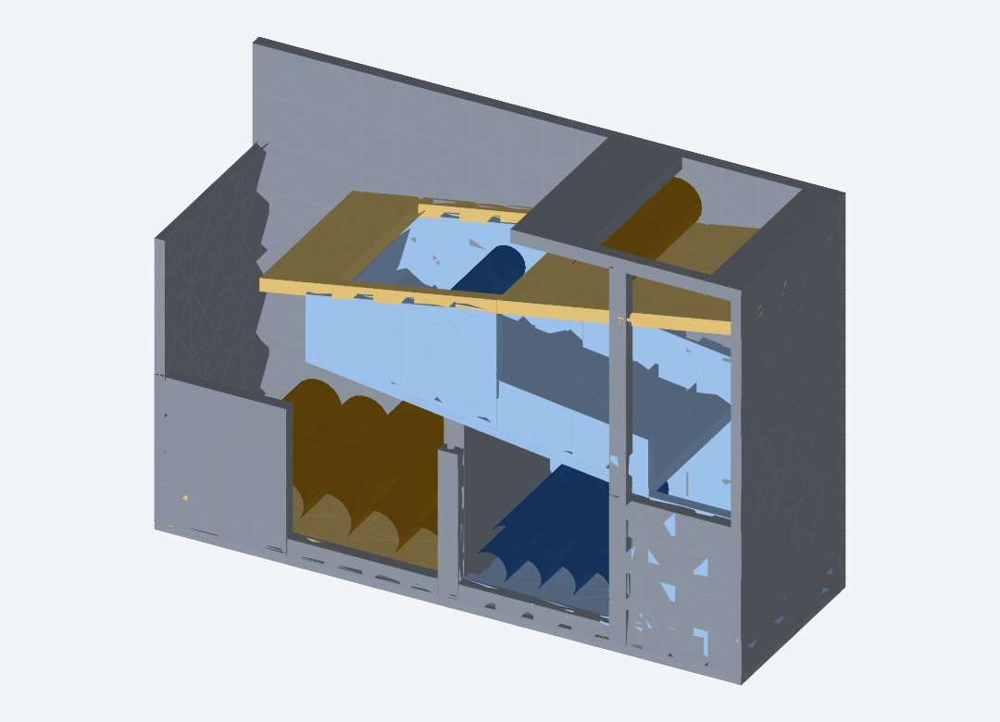

# ころころ電池ソーター(単3・単4 自動仕分けケース・引き出し式)

電池を上の投入口から**転がして入れるだけ**で、単3と単4をサイズの違いで自動的に
仕分けし、それぞれの**引き出し**の中に**きれいに整列**させて溜めるケースの3Dモデル。
**Bambu Lab A1 mini(180×180×180mm)でそのまま印刷できるサイズ**(178×62.5×144mm)。

印刷するのは3ファイル: **`battery_sorter_case.stl`(本体)+ 引き出し×2**。



## 仕分けの仕組み(サイズ差の利用)

| | 直径 | 長さ |
|---|---|---|
| 単3 (AA) | 14.5 mm | 50.5 mm |
| 単4 (AAA) | 10.5 mm | 44.5 mm |

「長さの差 6mm」を使う。上段の坂(勾配10°)の床に **幅46mmのスロット(長穴)** が
開いている。

1. 投入口から入れた電池は横向きに寝て坂を転がる(開口は37mmで単4の長さより
   狭いので、間違った向きでは物理的に入らない)
2. **単4(長さ44.5mm)** … 44.5 < 46 なのでスロットを橋渡しできず、**必ず落ちる**。
   下段の坂(勾配7.7°)で右端へ運ばれ、天井の落とし口から単4引き出しの中へ
3. **単3(長さ50.5mm)** … スロットの両脇に残した幅3.25mmの棚(レッジ)に両端が
   常に乗って通過。レーンの側壁が斜めへの向き変わりも防ぐので、**幾何学的に
   絶対に落ちない**(転がる速さや勢いに関係なく確実)。そのまま坂を転がりきり、
   左端の落とし口から単3引き出しの中へ

## 収納と取り出し(引き出し式)

- 各引き出しは内寸の奥行きを「電池の長さ+約2mm」にしてあるので、落ちた電池は
  自動的に**向きがそろい**、内側の床の傾き(5°)で**仕切り側に寄って積み重なる**
- 収納数の目安: **単3 約14本、単4 約22本**
- 前面の**指穴(28×14mm)**に指をかけて**手前に引き出すだけ**。指穴は中の残量が
  見えるのぞき窓も兼ねる
- 引き出しの摺動クリアランスは0.5mm

## ファイル

| ファイル | 内容 |
|---|---|
| `battery_sorter_case.stl` | **本体**(仕分け機構つきケース) |
| `battery_sorter_drawer_aa.stl` | **単3引き出し** |
| `battery_sorter_drawer_aaa.stl` | **単4引き出し** |
| `generate.py` | 3つのSTLを生成するスクリプト(**Python標準ライブラリのみ**、依存なし)。寸法の変更もここで |
| `preview_iso1.svg` | プレビュー画像(generate.py が生成) |

```bash
python3 generate.py   # 寸法を変えたら再実行して STL を再生成
```

## 主要寸法

- 本体外形: **178 × 62.5 × 144 mm**(A1 mini のビルドボリューム180mm角に収まる)
- 引き出し外形: 82 × 58 × 57.5 mm(2杯ともA1 miniで余裕)
- 仕分けスロット: 幅46 × 開口50mm、レッジ幅3.25mm
- 単3引き出し内寸 77 × 52.5mm / 単4引き出し内寸 77 × 46mm
- 壁厚 2.5〜3.5mm、坂の板厚 4mm

## 3Dプリントするときのメモ

- 本体は底面をベッドにして立てたまま印刷し、坂と天板の下にサポートを付けるのが素直
- 引き出しはそのままの向きでほぼサポート不要(指穴の上辺に28mmのブリッジがあるだけ)
- 引き出しがきつい場合は側面を軽くやすりがけ(クリアランスは0.5mm)
- プリンタの誤差によっては `generate.py` の `slot_w`(46mm)を±0.5mm調整
  (単4が引っかかる→広げる / 単3の端の乗りが浅い→狭める)
- 坂の上面のシームやサポート跡は軽くやすりがけすると電池がよく転がる
- 実物で試す前に、単3がスロットを渡ること・単4が落ちることを1本ずつ確認
