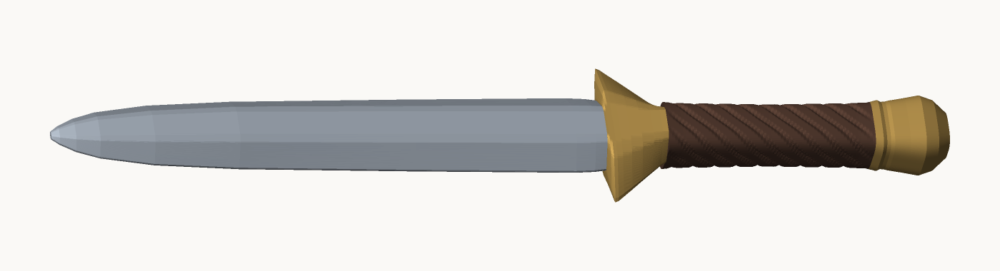
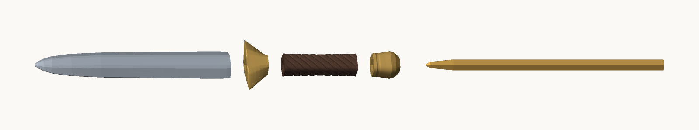
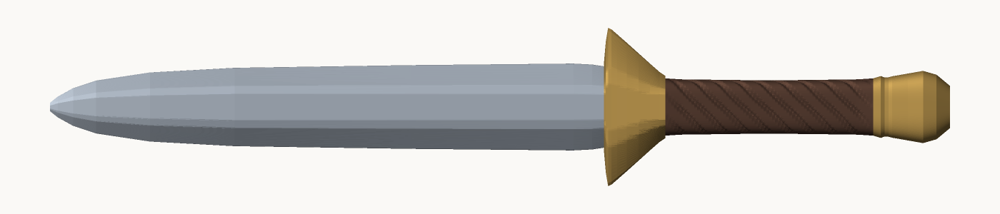
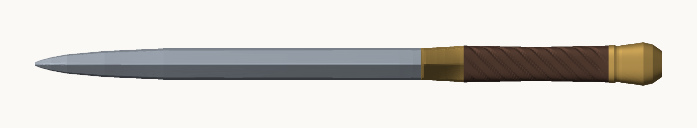
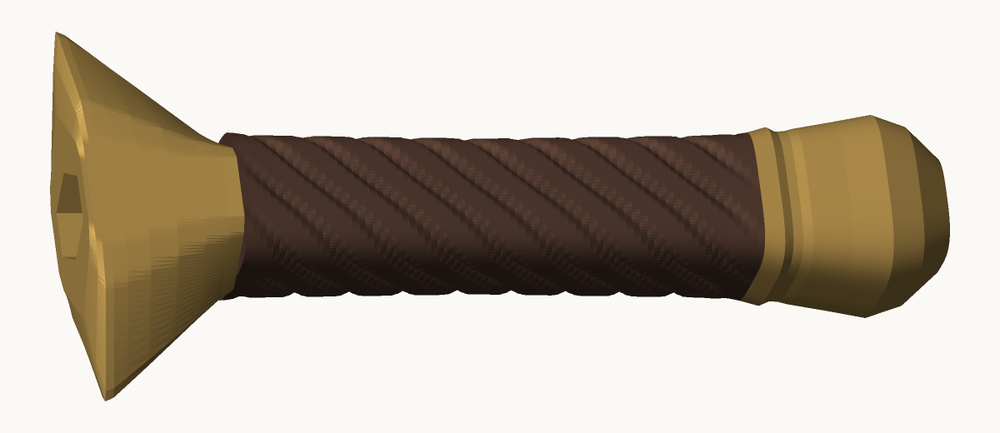
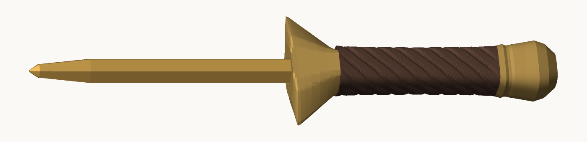

# 六角鉛筆ソード

普通の六角鉛筆に差すだけで、**全長 234mm の剣**になる 4 部品セット。
剣身が先端キャップを兼ねているので、抜けばそのまま書ける。



---

## 部品



右から順に、鉛筆 → 柄頭 → 握り → 鍔 → 剣身 と差していく。

| ファイル | 部位 | 外寸 (W×D×H) | 中実体積 | 役目 |
|---|---|---|---|---|
| `stl/01_blade_ken.stl` | 剣身 | 22.6 × 12.0 × **144.0** mm | 17.3 cm³ | 下 96mm が鉛筆をくわえる袋穴。先端キャップ兼用 |
| `stl/02_guard_tsuba.stl` | 鍔 | **41.2** × 13.8 × 16.0 mm | 3.3 cm³ | 貫通穴。剣身と握りの間に挟まる |
| `stl/03_grip_tsuka.stl` | 握り | 14.9 × 14.0 × 54.0 mm | 5.8 cm³ | 貫通穴。8 条の螺旋溝で柄巻き風 |
| `stl/04_pommel.stl` | 柄頭 | 18.8 × 16.4 × 20.0 mm | 3.2 cm³ | 袋穴。鉛筆のお尻に被さって蓋になる |
| `stl/05_fit_test_rings.stl` | 試し輪 | 3 個 | 3.6 cm³ | **先にこれだけ刷る**（後述） |

4 部品あわせて中実 29.6 cm³。充填 20% なら**フィラメント 16g 前後**。

### 積むと

```
         剣身 144mm            鍔16   握り54mm    柄頭20mm
  ◁────────────────────────┤    ╱▔╲ ├────────┤ ╭──╮
  切先                    肩  ╱    ╲          ╰──╯
  └── 鉛筆の先が入るのはここまで 96mm ──┘
                                          全長 234mm
```

刃 144mm ／ 柄まわり 90mm ＝ 剣らしい 6：4 の比率になるように、
新品の鉛筆（176mm）がちょうど全部隠れる位置で区切ってある。

| 正面 | 真横 |
|---|---|
|  |  |



---

## 鉛筆と、はめあい

対象は **JIS 六角鉛筆（対辺 7.8mm・長さ 176mm）**。三菱・トンボの普通の鉛筆はこれ。

穴は 3 段構えになっている。

- **本体の穴 対辺 8.45mm** … するする通る
- **抜け止めリブ 6 本**（高さ 0.25mm・実効対辺 7.95mm）… 六角の「面」の真ん中を押さえる
- リブは細いので、鉛筆が 7.6mm でも 8.0mm でも、たわんで効いてくれる

FDM は穴が 0.1〜0.3mm ほど小さめに出るので、この寸法で**ちょうど固すぎず抜けない**あたりに落ちる。
ただしプリンタとフィラメントで変わるので──

### 必ず先に `05_fit_test_rings.stl` を刷る

高さ違いの輪が 3 個入っている。**低いほどきつい。**

| 高さ | 穴 対辺 | |
|---|---|---|
| 8mm | 8.20mm | きつめ |
| 11mm | 8.45mm | 標準（本番と同じ） |
| 14mm | 8.70mm | ゆるめ |

本番と同じ抜け止めリブが入っているので、「挿さるか」だけでなく
「押し込んだあと落ちないか」までそのまま確かめられる。
15 分ほどで刷れる。鉛筆に挿してみて、ちょうどいい高さの輪を覚えておく。

- **11mm がちょうど** → そのまま本番を刷る
- **8mm がちょうど**（＝標準はゆるい） → `generate.py` の `BORE_AF` を `8.20` に
- **14mm がちょうど**（＝標準はきつい） → `BORE_AF` を `8.70` に

変えたら `python3 generate.py` で STL を作り直す。

---

## 印刷

**サポートは要らない。** 出っぱりの傾きは全部 42° 以下に収めてある。
どの部品も**軸を立てて、そのまま置く**（STL は最初からその向き）。

| | |
|---|---|
| 材質 | PLA / PETG。剣身が長いので反りに強い PETG だとなお良い |
| ノズル | 0.4mm |
| 層の高さ | 0.16〜0.20mm |
| 壁 | **3 周以上**（いちばん薄いところが 1.5mm なので、3 周でちょうど埋まる） |
| 充填 | 15〜25%（剣身は 20% 以上にすると折れにくい） |
| サポート | **なし** |
| ブリム | **剣身だけ付ける**（22×12mm の底で 144mm 立つので、無いと倒れることがある） |

- 剣身の袋穴の天井は 9.8mm のブリッジになる。標準設定で問題なく渡る
- 柄頭は底が平らなので、そのままベッドに置けば密着する
- 4 部品まとめて刷るより、**剣身だけ単独**で刷ったほうが失敗しにくい

刷り上がりの目安は合計 4〜6 時間くらい。

---

## 組み立て

1. 鉛筆のお尻に **柄頭** を突き当たるまで押し込む
2. 先端側から **握り** を通して、柄頭に密着させる
3. **鍔** を通して、握りに密着させる
4. **剣身** を被せる。鍔の天面に座るところまで押し込む

剣身は鉛筆の先ではなく**鍔の上に座る**設計なので、鉛筆を削って短くなっても
剣の全長 234mm は変わらない。

> 鉛筆が 105mm より短くなると、剣身の抜け止めリブ（根元から 6〜16mm）まで
> 届かなくなって剣身がぐらつく。そこまで使ったら鉛筆を替えどき。

### 書くとき



剣身を抜けば、先が 88mm 出た状態でそのまま書ける。
鍔が手に当たるなら鍔も抜いてしまえば、握りが太軸グリップとして効く。
剣身は書いている間、根元の平らな底で**切先を上に立てておける**。

---

## 寸法を変える

`generate.py` の頭に調整パラメータがまとまっている。

```python
PENCIL_AF   = 7.8    # 鉛筆の対辺距離
BORE_AF     = 8.45   # 穴の対辺距離  ← はめあいはここ
RIB_AF      = 7.95   # 抜け止めリブ頂点での実効対辺距離
BLADE_LEN   = 144.0  # 剣身の長さ
GRIP_LEN    = 54.0   # 握りの長さ
...
```

```bash
python3 generate.py              # STL とプレビュー PNG を出力
python3 generate.py --no-preview # STL だけ
```

必要なのは Python 3 と numpy だけ。CAD もブーリアン演算のライブラリも要らない。

各部品の形は「輪（リング）を z 方向に積み重ねる」だけで作っていて、
外側の面・穴の内側の面・端の輪っか蓋、をそれぞれ張って中空の立体にしている。
出力前に**全ての有向辺が逆向きと対になっているか**を確かめているので、
STL は必ず閉じた立体になる（スライサで穴埋めが要らない）。

形を変えたいときの入口:

| 関数 | いじると |
|---|---|
| `part_blade()` | `profile` の `(z, 半幅, 半厚, 鎬の半幅)` で刃の輪郭 |
| `part_guard()` | `profile` の `(z, 半幅, 半厚)` で鍔の張り出し |
| `part_grip()` | `n_groove` / `helix` / `depth` で柄巻きの見え方 |
| `part_pommel()` | `profile` の `(z, hx, hy, 角ばり具合)` で柄頭の丸み |
| `blade_radii()` | 断面そのもの（今は鎬地＋二段の刃付け） |

外形を変えたら、下のチェックを通しておくと安心:

```
最小肉厚         剣身 1.68 / 鍔 1.78 / 握り 1.51 / 柄頭 1.91 mm
最大オーバーハング  剣身  8.5 / 鍔 42.0 / 握り 33.5 / 柄頭 42.3 °
```

肉厚は 1.2mm を下回らないように、オーバーハングは 45° を超えないように
（超えるとサポートが要る）。

---

## ひとこと

刃は付いていない。切先はわざと 2.2 × 1.2mm の平らにしてあるし、
刃にあたる部分も 0.6mm の平らを残している。とはいえ 3D プリントの角は
それなりに硬いので、人に向けないこと。

学校に持っていくなら、**剣身を外して筆箱に入れる**のが無難。
