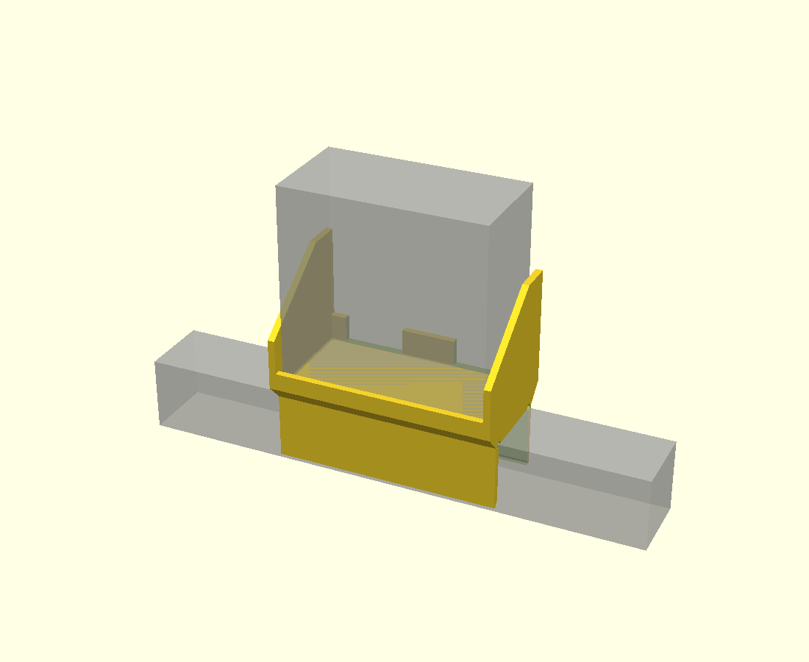
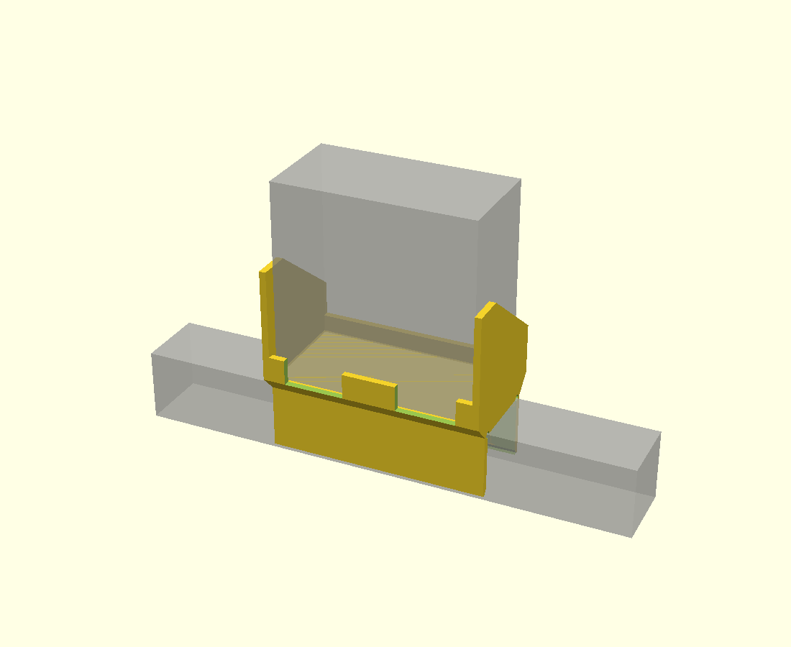

# SAC-5A 制御タイマー用 ベッドフレーム上置きホルダー

定刻起床装置 個人簡易型 **SAC-5A型**（新光電業株式会社）の
**制御タイマー〈型式 SUK-49〉**＝「ボタンがたくさん付いている方」を、
**43 × 43 mm の角パイプ製ベッドフレームの上**に設置するための 3D プリント部品です。

- 角パイプに **上からかぶせる** ∩ 形の脚（ねじ・金具なし）
- その **真上のベースプレート** にポケットが載る
- 制御タイマーは **上から落とし込んで** 差し込む



| 側面図 | 背面側から |
|---|---|
|  |  |

（グレーの半透明が制御タイマー本体と角パイプの想定位置）

---

## 1. 寸法の根拠

### 制御タイマー（SUK-49）

新光電業(株) SAC-5A型 取扱説明書「主な製品仕様」より：

| 項目 | 値 |
|---|---|
| 外形寸法 | **高さ 120 × 幅 120 × 奥行 60 (mm)** |
| 重量 | **500 (g)** |
| 定格電圧 / 電力 | AC100±10% (V) / 10 (W) |
| 使用電池 | 単3形アルカリ乾電池 2本 |

同説明書の外観図から、設計上で避けなければならない要素：

| 面 | 要素 | 本設計での扱い |
|---|---|---|
| 正面 | 上部に **停止ボタン A / B**、ディスプレイ | 全部ポケットより上に出る |
| 正面 | 下半分に **操作ボタン 11個**（メニュー / アラーム / 起床設定 / 戻る / 決定 / すすむ・もどる / 切替） | 表示側リップを **10 mm** に抑えて塞がない |
| 背面 | **送風機プラグ差込口 / 電源ケーブル差込口** | ケーブル側リップを **15 mm**（差込口は底から約 20 mm より上）に抑え、背面は開放 |
| 背面 | **電池カバー + ツマミ**（回して外す） | 背面が完全に空中に出るので、**載せたまま電池交換できる** |

> 差込口の**正確な XY 位置は説明書に寸法記載がない**ため、
> 「背面をまるごと開放する」設計にして位置に依存しないようにしています。

### ベッドフレーム

| 項目 | 値 |
|---|---|
| 角パイプ断面 | **43 × 43 (mm)**（ご指定寸法） |
| はめあいクリアランス | +0.6 mm（内寸 43.6 mm） |

> ⚠️ 「43角」と言っても実物は 42.6〜43.4 mm 程度ばらつきます。
> **必ずノギスで実測**して、きつい／緩い場合は `RAIL_CLR` を調整してください。

### 出典

- 新光電業(株)『定刻起床装置個人簡易型 SAC-5A型 取扱説明書』
  <https://sort-inc.net/p2-product/a1-kisyou/images/pdf/2_k-1-1-2022.pdf>
- JRE MALL 商品ページ（定刻起床装置 個人簡易型 SAC-5A型 / 新光電業(株)）
  <https://shopping.jreast.co.jp/products/detail/s012/s012-001>

---

## 2. 設計の要点

```
                  ┌──────────┐
                  │          │  ← 制御タイマー(120×120×60)
        寝ている   │  表示    │     背面は空中 = ケーブルも電池カバーも自由
        側 (−Y)   │  ボタン  │
                  │        ██│  ← ケーブル側の側壁は重心より高い 68mm
              ┌───┴──────────┴───┐
        低い  │   ベースプレート   │  ← レール上面から +10 mm
        リップ└───┐          ┌───┘  ← 45度未満で絞ってサポートレス
        (10mm)    │ ∩ の脚   │
             ═════╪══════════╪═════  角パイプ 43×43
```

**① フレームの「上」に置く利点**

本体の背面が完全に空中に出ます。その結果、

- 送風機プラグ・電源ケーブルを挿しても、後ろに角パイプが来ない
- 電池カバーのツマミも回せるので、**載せたまま年1回の電池交換ができる**
- 荷重が角パイプの真上に載るので**片持ちにならず**、曲げがほぼ発生しない

**② 向き**

- **−Y 側（寝ている人の側）** … 表示・操作ボタン面。リップ 10 mm、側壁 30 mm と低く抑えて、
  ベッドの中から**停止 A / 停止 B を同時に押せる**ようにしています
- **+Y 側（外側）** … 背面。ケーブルはベッドの外側に抜けて下へ降ります。
  側壁は 68 mm と高く、**本体の重心（底から 60 mm）より上**まで支えます

向きを逆にしたい場合は `FLIP_Y = true` にして再ビルドしてください。

**③ ベースプレートの絞り**

脚の外寸（51.6 mm）からポケットの外寸（71 mm）へ、**垂直から 44 度**で広げています。
45 度を超えないので、サポートなしで造形できます。

---

## 3. できあがり寸法

| 項目 | 値 |
|---|---|
| 全体寸法 | **131 (W) × 71 (D) × 116 (H) mm** |
| 本体の設置高さ | 角パイプ上面から **+10 mm**（本体の天面はレール上面 +130 mm） |
| ポケット内寸 | 123 (W) × 63 (D) mm（本体 120×60 に片側 1.5 mm クリアランス） |
| 脚の内寸 | 43.6 mm |
| 体積 | 155.5 cm³ |
| 造形重量の目安 | 100 % 充填で約 193 g / 実用設定で **140〜170 g 程度** |

---

## 4. 3D プリント

**サポート不要**です。STL / 3MF は既に造形向きで Z=0 に配置してあります。

| 項目 | 推奨 |
|---|---|
| 造形向き | **そのまま**（脚の下端が造形テーブル面、ポケットが上） |
| **ブリム** | **推奨**。テーブルに接するのは脚の下端だけ（約 1000 mm²）で、高さ 116 mm あります |
| 材料 | **PETG / ABS / ASA 推奨**。PLA でも可だが、夏場の室温＋常時荷重でのクリープを避けたいなら PETG |
| 積層ピッチ | 0.2 mm |
| ウォール | **4 本以上**（肉厚 4 mm に対して実質ソリッドになる） |
| 充填 | 20 % 以上（グリッド / ジャイロイド） |
| サポート | **不要** |
| ブリッジ | ベースプレートの裏側が **43.6 mm のブリッジ**になります（1 か所だけ）。ブリッジが苦手なプリンタはこの部分にだけサポートを追加してください |

STL の下向き面はすべて確認済みで、45 度を超える未サポート面はこのブリッジ 1 か所だけです。

---

## 5. 組み立て・取り付け

**ねじ・金具は不要です。**

1. ベッドフレームの角パイプに、ホルダーを**上からかぶせる**
   （脚の下端 3 mm が広がっているので入りやすいはずです）
2. 制御タイマーを**上から落とし込む**
   — **表示・ボタン面が寝ている側**、**背面（ケーブル）が外側**
3. 背面から**送風機プラグと電源ケーブルを接続**し、
   ケーブル側リップの切り欠きを通してベッドの外側へ降ろす

電池交換（年1回）は、**載せたまま**背面のツマミを回して電池カバーを外せます。

### ⚠️ 停止ボタンを押したときのガタつきについて

本体はレールの真上、**重心が角パイプ上面から約 70 mm** の位置に載ります。
はめあいに 0.6 mm の隙間があるため、停止 A / B を押すと**わずかに首を振ります**
（本体天面で 3 mm 程度）。落ちることはありませんが、気になる場合は次のどちらかで止まります。

- 脚の内側に**フェルトかゴムシートを 1 枚貼る**（いちばん手軽）
- `RAIL_CLR` を 0.4 に下げて再ビルドする
- `CLAMP_SCREWS = true` にして再ビルドすると、表示側の脚に **M4 ねじボスが 2 か所**生えます
  （M4 × 25 なべ小ねじ × 2 本、下穴 Ø3.4 のセルフタッピング。締めすぎるとボスが割れるので手応えが出たら止める）

---

## 6. 寸法を変えたいとき

`sac5a_controller_mount.scad` の冒頭パラメータを書き換えて再ビルドします。
よく触るものだけ抜粋：

| パラメータ | 既定値 | 説明 |
|---|---|---|
| `RAIL_W` / `RAIL_H` | 43 | 角パイプの実測断面 |
| `RAIL_CLR` | 0.6 | はめあい。**きつい → 0.8 / ゆるい → 0.4** |
| `DEV_CLR` | 1.5 | 本体まわりの片側クリアランス |
| `LEG_DROP` | 38 | 脚の掛かり深さ |
| `PLATE_T` | 10 | ベースプレート厚。**薄くすると絞りが 45 度を超える**ので注意 |
| `POCKET_Y` | 0 | ポケットを外側／内側へずらす量（マットレスに当たる場合に） |
| `SIDE_H_CABLE` / `SIDE_H_FACE` | 68 / 30 | 側壁の高さ（外側 / 寝ている側） |
| `LIP_FACE_H` | 10 | 表示側リップ。**上げすぎると操作ボタンを塞ぐ** |
| `LIP_CABLE_H` | 15 | ケーブル側リップ。**上げすぎると差込口を塞ぐ** |
| `FLIP_Y` | false | true で表示面の向きを反転 |
| `CLAMP_SCREWS` | false | true で脚に M4 ねじボスが 2 か所生える |

### ビルド

```sh
./build.sh          # STL / 3MF / プレビュー画像を再生成
```

または個別に：

```sh
openscad --export-format binstl -o stl/sac5a_controller_mount.stl sac5a_controller_mount.scad
openscad -o stl/sac5a_controller_mount.3mf                        sac5a_controller_mount.scad
```

`preview.scad` を OpenSCAD で開くと、制御タイマーと角パイプの想定位置を
半透明で重ねて確認できます。

---

## 7. ファイル

| ファイル | 内容 |
|---|---|
| `sac5a_controller_mount.scad` | パラメトリック CAD 本体（OpenSCAD） |
| `preview.scad` | 本体・角パイプを重ねた確認用 |
| `build.sh` | STL / 3MF / 画像の再生成 |
| `stl/sac5a_controller_mount.stl` | 造形用（バイナリ STL、造形向きで配置済み） |
| `stl/sac5a_controller_mount.3mf` | 造形用（3MF） |
| `img/*.png` | プレビュー画像 |

---

## 8. 注意

- 本部品は **新光電業株式会社とは無関係**の非公式アクセサリです。
- 制御タイマーの寸法は取扱説明書の公称値（120 × 120 × 60）に基づく設計です。
  **角パイプの断面と本体の実物は、印刷前にノギスで実測することを強く推奨します。**
- 本体はレールの上に**載っているだけ**で、上方向に抜け止めはありません。
  ベッドの乗り降りでぶつけそうな位置なら、`POCKET_Y` でずらすか設置場所を見直してください。
- 500 g の機器を載せるため、**印刷後は必ず手で荷重をかけて確認**してから本番運用してください。
