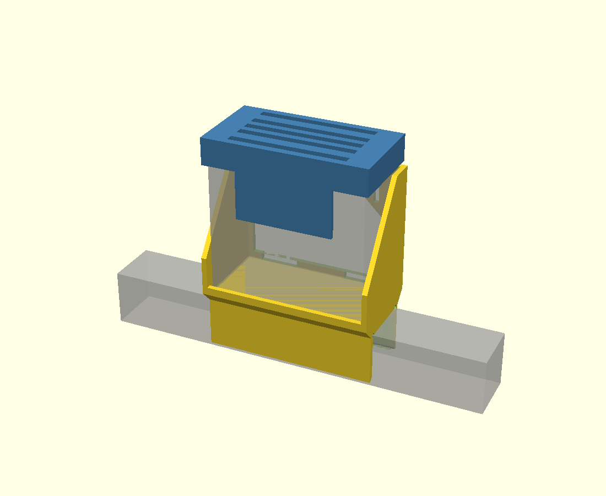
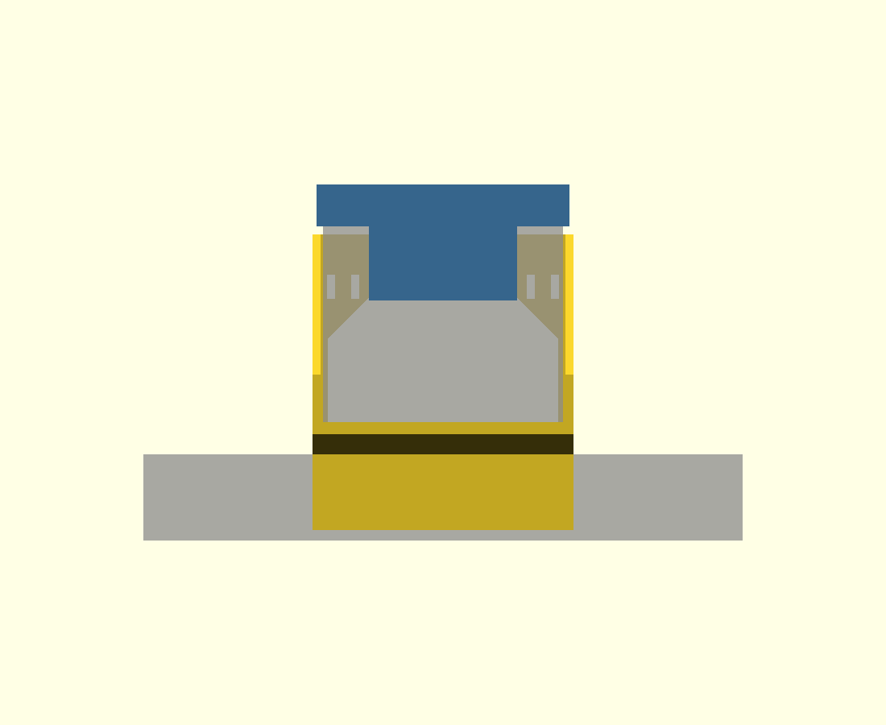
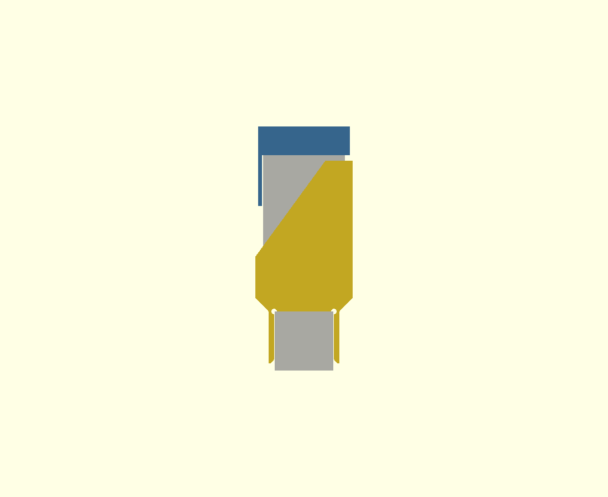

# SAC-5A 制御タイマー用 ベッドフレーム上置きホルダー

定刻起床装置 個人簡易型 **SAC-5A型**（新光電業株式会社）の
**制御タイマー〈型式 SUK-49〉**＝「ボタンがたくさん付いている方」まわりの 3D プリント部品です。

| 部品 | 役目 |
|---|---|
| **ホルダー** `sac5a_controller_mount.scad` | 43 × 43 mm の角パイプ製ベッドフレームの**上**に設置する（1〜6 章） |
| **液晶めかくしフード** `sac5a_display_hood.scad` | 夜まぶしい液晶に**上からかぶせる蓋**（7 章） |

どちらも**ねじ・金具なし／サポートなし**で造形・組み立てできます。

---

## ホルダー

- 角パイプに **上からかぶせる** ∩ 形の脚（ねじ・金具なし）
- その **真上のベースプレート** にポケットが載る
- **背面パネル**が左右の側壁を繋いで箱剛性を出し、本体の背面を受け止める
- 背面パネルの**大開口**が、そのまま差込口・電池カバー・**ケーブルの通り道**になる


| 側面図 | 背面側から |
|---|---|
|  |  |

（グレーの半透明が制御タイマー本体と角パイプの想定位置）

---

## 1. 寸法の根拠

### 制御タイマー（SUK-49）の外形

新光電業(株) SAC-5A型 取扱説明書「主な製品仕様」より：

| 項目 | 値 |
|---|---|
| 外形寸法 | **高さ 120 × 幅 120 × 奥行 60 (mm)** |
| 重量 | **500 (g)** |
| 定格電圧 / 電力 | AC100±10% (V) / 10 (W) |
| 使用電池 | 単3形アルカリ乾電池 2本 |

### 盤面の要素配置（取扱説明書「各部名称」図からの実測）

背面パネルをどこに張れるかを決めるため、取扱説明書の外観図を 400 dpi で描画して
各要素の位置を読み取りました。**120 × 120 の盤面に対し、左端／底面からの mm** です。

**≪背面≫**

| 要素 | 左端から | 底面から |
|---|---|---|
| 送風機プラグ差込口（AC コンセント） | 14 〜 35 | **24 〜 40** |
| 電源ケーブル差込口 | 14 〜 35 | **14 〜 22** |
| 電池カバー | 47 〜 113 | **9 〜 42** |
| ツマミ | 約 80 | **42 〜 48** |

→ **底から約 48 mm より上は完全な平面**。ここから上に背面パネルを張れば何も塞ぎません。
→ 差込口が左右どちらに来るかは設置の向き次第なので、**開口は左右対称**にしてあります。

**≪正面≫**

| 要素 | 底面から |
|---|---|
| 最下段の[戻る]ボタン 下端 | **8** |

→ 表示側リップは **6 mm** に抑えました（初版の 10 mm はボタンに僅かに掛かっていました）。

> ⚠️ これらは図面からの**読み取り値**で、寸法として記載されているものではありません。
> ±2 mm 程度の誤差を見込んで設計してあります。

### ベッドフレーム

| 項目 | 値 |
|---|---|
| 角パイプ断面 | **43 × 43 (mm)**（ご指定寸法） |
| はめあいクリアランス | +0.6 mm（内寸 43.6 mm） |

> ⚠️ 「43角」と言っても実物は 42.6〜43.4 mm 程度ばらつきます。
> **必ずノギスで実測**して、きつい／緩い場合は `RAIL_CLR` を調整してください。

### 出典

- 新光電業(株)『定刻起床装置個人簡易型 SAC-5A型 取扱説明書』
  <https://sort-inc.net/p2-product/a1-kisyou/images/pdf/2_k-1-1-2022.pdf>
- JRE MALL 商品ページ（定刻起床装置 個人簡易型 SAC-5A型 / 新光電業(株)）
  <https://shopping.jreast.co.jp/products/detail/s012/s012-001>

---

## 2. 設計の要点

```
   寝ている側 (−Y)                              外側 (+Y)

              ┌────────────────┐
              │                │ ← 本体の上 20mm は背面パネルより上に出る
              │                ├──┐
              │                │██│ ← 背面パネル 100mm : 左右の側壁を繋ぐ
              │  表示          │  │
              │  ボタン        │╱ ╲  ← 開口の上端は 45 度で絞る(サポートレス)
              │                │   │
              │              48├───┤ ← ツマミ上端。ここから下は全開
              │      ┌─────────┴───┴──┐
              │      │ 差込口 / 電池カバー │ ← 全部この開口の中
        低い  │      │ ケーブルはここを通る │
        リップ└──┐   └──────────┬───────┘
        (6mm)   │  ベースプレート │      ← レール上面から +10 mm
             ───┤                 ├───   ← 45度未満で絞ってサポートレス
                │    ∩ の脚      │
           ═════╪═════════════════╪═════  角パイプ 43×43
```

**① フレームの「上」に置く利点**

本体の背面が空中に出るので、

- 送風機プラグ・電源ケーブルを挿しても、後ろに角パイプが来ない
- 荷重が角パイプの真上に載るので**片持ちにならず**、曲げがほぼ発生しない

**② 背面パネルが効かせている剛性**

初版は左右の側壁が**ベースプレートだけで繋がっていて**、上端が開いた「コの字」でした。
背面パネルを入れると閉じた箱断面になり、側壁が開く向きのねじれが止まります。
高さ 100 mm は本体の重心（底から 60 mm）を大きく超えているので、
後ろに倒れる方向も受け止めます。

**③ ケーブルの通り道**

- 開口（底から 5 〜 48 mm、幅 115 mm）に**差込口が丸ごと入る**ので、
  プラグを挿しても背面パネルに当たりません
- 底のリップには**左右対称の切り欠き**があり、ケーブルをベースプレート面まで
  落としてベッドの外側へ逃がせます
- 背面パネルの左右に **結束バンド用スリット（4 × 12 mm × 2 組）** があります。
  ケーブルをここで留めておくと、本体を持ち上げても引っ張られません
- 電池カバーもツマミも開口の中なので、**載せたまま年1回の電池交換ができます**

**④ 向き**

- **−Y 側（寝ている人の側）** … 表示・操作ボタン面。リップ 6 mm、側壁 30 mm と低く抑えて、
  ベッドの中から**停止 A / 停止 B を同時に押せる**ようにしています
- **+Y 側（外側）** … 背面パネルとケーブル。ケーブルはベッドの外側へ降ります

向きを逆にしたい場合は `FLIP_Y = true` にして再ビルドしてください。

---

## 3. できあがり寸法

| 項目 | 値 |
|---|---|
| 全体寸法 | **131 (W) × 71 (D) × 148 (H) mm** |
| 本体の設置高さ | 角パイプ上面から **+10 mm**（本体の天面はレール上面 +130 mm） |
| ポケット内寸 | 123 (W) × 63 (D) mm（本体 120×60 に片側 1.5 mm クリアランス） |
| 背面パネル | 高さ 100 mm / 開口 115 (W) × 43 (H) + 45 度の絞り |
| 脚の内寸 | 43.6 mm |
| 体積 | 177.9 cm³ |
| 造形重量の目安 | 100 % 充填で約 221 g / 実用設定で **160〜190 g 程度** |

厚い部分はベースプレート（10 mm）だけで、そこは充填率が効くため、
実際の造形重量は 100 % 充填の値よりかなり下がります。

---

## 4. 3D プリント

**サポート不要**です。STL / 3MF は既に造形向きで Z=0 に配置してあります。

| 項目 | 推奨 |
|---|---|
| 造形向き | **そのまま**（脚の下端が造形テーブル面、ポケットが上） |
| **ブリム** | **推奨**。テーブルに接するのは脚の下端だけ（約 400 mm²）で、高さ 148 mm あります |
| 材料 | **PETG / ABS / ASA 推奨**。PLA でも可だが、夏場の室温＋常時荷重でのクリープを避けたいなら PETG |
| 積層ピッチ | 0.2 mm |
| ウォール | **4 本以上**（肉厚 4 mm に対して実質ソリッドになる） |
| 充填 | 20 % 以上（グリッド / ジャイロイド） |
| サポート | **不要** |

### ブリッジになる箇所

STL の下向き面を全数チェックしてあります。45 度を超える未サポート面は次の 2 か所だけです。

| 場所 | スパン | 造形時の高さ |
|---|---|---|
| ベースプレートの裏（角パイプの上） | 43.6 mm | z = 38 |
| 背面開口の天井 | **41 mm** | z = 133 |

どちらも一般的なブリッジ長です。背面開口の上端を 45 度で絞ることで、
本来 115 mm になるはずのブリッジを 41 mm まで短くしています。
ブリッジが苦手なプリンタはこの 2 か所にだけサポートを追加してください。

---

## 5. 組み立て・取り付け

**ねじ・金具は不要です。**

1. ベッドフレームの角パイプに、ホルダーを**上からかぶせる**
   （脚の下端 3 mm が広がっているので入りやすいはずです）
2. 制御タイマーを**上から落とし込む**
   — **表示・ボタン面が寝ている側**、**背面が外側（背面パネル側）**
3. 背面の開口から**送風機プラグと電源ケーブルを接続**する
4. ケーブルを底のリップの切り欠きに落として外側へ降ろし、
   必要なら**結束バンド用スリット**で背面パネルに留める

電池交換（年1回）は、**載せたまま**開口からツマミを回して電池カバーを外せます。

### ⚠️ 停止ボタンを押したときのガタつきについて

本体はレールの真上、**重心が角パイプ上面から約 70 mm** の位置に載ります。
はめあいに 0.6 mm の隙間があるため、停止 A / B を押すと**わずかに首を振ります**
（本体天面で 3 mm 程度）。落ちることはありませんが、気になる場合は次のどれかで止まります。

- 脚の内側に**フェルトかゴムシートを 1 枚貼る**（いちばん手軽）
- `RAIL_CLR` を 0.4 に下げて再ビルドする
- `CLAMP_SCREWS = true` にして再ビルドすると、表示側の脚に **M4 ねじボスが 2 か所**生えます
  （M4 × 25 なべ小ねじ × 2 本、下穴 Ø3.4 のセルフタッピング。締めすぎるとボスが割れるので手応えが出たら止める）

---

## 6. 寸法を変えたいとき

`sac5a_controller_mount.scad` の冒頭パラメータを書き換えて再ビルドします。
よく触るものだけ抜粋：

| パラメータ | 既定値 | 説明 |
|---|---|---|
| `RAIL_W` / `RAIL_H` | 43 | 角パイプの実測断面 |
| `RAIL_CLR` | 0.6 | はめあい。**きつい → 0.8 / ゆるい → 0.4** |
| `DEV_CLR` | 1.5 | 本体まわりの片側クリアランス |
| `LEG_DROP` | 38 | 脚の掛かり深さ |
| `PLATE_T` | 10 | ベースプレート厚。**薄くすると絞りが 45 度を超える**ので注意 |
| `POCKET_Y` | 0 | ポケットを外側／内側へずらす量（マットレスに当たる場合に） |
| `SIDE_H_CABLE` | 100 | 側壁と背面パネルの高さ |
| `SIDE_H_FACE` | 30 | 表示側の側壁高さ |
| `LIP_FACE_H` | 6 | 表示側リップ。**8 mm を超えると[戻る]ボタンに掛かる** |
| `BACK_LIP_H` | 5 | 開口の下端。**9 mm を超えると電池カバーに掛かる** |
| `BACK_OPEN_HW` | 57.5 | 開口の半幅。**53 mm を下回ると電池カバーに掛かる** |
| `BACK_OPEN_TOP` | 48 | 開口の垂直部の上端。**ツマミ上端がここ** |
| `BACK_CHAMF` | 37 | 45 度の絞り高さ。**大きくするほど天井のブリッジが短くなる** |
| `TIE_SLOTS` | true | 結束バンド用スリット |
| `FLIP_Y` | false | true で表示面の向きを反転 |
| `CLAMP_SCREWS` | false | true で脚に M4 ねじボスが 2 か所生える |

### ビルド

```sh
./build.sh          # STL / 3MF / プレビュー画像を再生成
```

または個別に：

```sh
for p in sac5a_controller_mount sac5a_display_hood; do
    openscad --export-format binstl -o "stl/$p.stl" "$p.scad"
    openscad                        -o "stl/$p.3mf" "$p.scad"
done
```

`preview.scad` を OpenSCAD で開くとホルダー単体を、
`preview_assembly.scad` を開くと**ホルダー + 制御タイマー + フードの組み合わせ**を、
それぞれ半透明で重ねて確認できます。

---

## 7. 液晶めかくしフード（`sac5a_display_hood.scad`）

夜に液晶がまぶしいので、**上からかぶせる蓋**です。
普段はかぶせたままにしておき、時刻変更など画面を見る操作のときだけ真上に持ち上げて外します。



| 正面から | 側面から |
|---|---|
|  |  |

（青がフード、グレーの半透明が制御タイマーと角パイプ）

### 覆うもの／出すもの

取扱説明書の「各部名称」図を **800 dpi で描画して実測**し、盤面上の要素の位置を確定させました。
**120 × 120 の盤面に対し、左端／底面からの mm** です。

| 要素 | 左端から | 底面から | フードの扱い |
|---|---|---|---|
| **液晶ディスプレイ** | 25.8 〜 94.4 | **69.3 〜 104.2** | **覆う** |
| LED表示（電源/アラーム/停電/エラー） | 28.4 〜 63.7 | 56.4 〜 64.6 | 出す |
| **アラームボタン** | 73.1 〜 93.6 | **39.8 〜 49.2** | **出す** |
| 停止ボタン A | 2.6 〜 19.7 | 79 〜 94 | **出す** |
| 停止ボタン B | 99.5 〜 116.1 | 79 〜 94 | **出す** |
| メニュー / 決定 / 切替 / 起床設定 / 戻る / すすむ / もどる | — | 9 〜 49 | 出す |

この配置から 2 つの寸法が決まりました。

- **バイザーの半幅 37 mm** — 液晶は盤面のほぼ中央（中心から ±34.4 mm）に対し、
  停止ボタンはその外側（±40.3 mm より外）にあります。半幅 37 mm なら
  **液晶を完全に覆ったまま、停止 A / B を両方とも露出**できます
  （液晶側に 2.6 mm、停止 A に 3.3 mm、停止 B に 2.5 mm の余裕）
- **バイザー下端 67 mm** — 液晶の下端（69.3 mm）と LED表示の上端（64.6 mm）の
  あいだに収まる高さです。**LED表示が見えるので、かぶせたままアラームを
  セットしても「アラーム LED が点いた」ことで確認できます**

結果として、**覆われるのは液晶だけ**で、**11 個の操作ボタンは全部押せます**。
ただし画面は見えないので、時刻変更など画面を見る操作のときは外してください。

> LED表示も覆いたい場合は `VISOR_BOTTOM` を **53** にしてください。
> それでもアラームボタン（上端 49.2 mm）は押せます。

> 💡 そもそも取扱説明書の【設定】メニューで **LCD（ディスプレイ）の明るさ** と
> **LED の明るさ** をそれぞれ 2 段階で変えられます（P.12）。
> フードと併用すると、より暗くできます。

### 固定のしかた

本体の上端 **16 mm を全周で囲むキャップ**になっていて、片側 0.5 mm のはめあいで
本体にかぶさります。天板が本体の上面に載るので、それ以上は下がりません。
外すときは**真上に持ち上げるだけ**です。

- ホルダーの背面パネル（上端はレール上面 +110 mm）とは **2 mm 以上離れている**ことを
  形状の交差計算で確認済みです（干渉体積 0 mm³）
- 天板にスリットが 5 本あります。**通気**（本体は定格 10 W）と**指がかり**を兼ねています。
  天板は 2 mm のリブで本体上面から浮かせてあるので、スリットが塞がりません

### 寸法・プリント

| 項目 | 値 |
|---|---|
| 全体寸法 | **127 (W) × 67 (D) × 58 (H) mm** |
| 体積 | 48.3 cm³（100 % 充填で約 60 g） |
| 造形向き | **天板を下にして配置済み**。テーブルとの接地は 127 × 67 mm で安定 |
| サポート | **不要**（宙に浮いた水平面はゼロ） |
| ブリム | 不要 |

| パラメータ | 既定値 | 説明 |
|---|---|---|
| `FIT` | 0.5 | 片側クリアランス。**きつくて入らない → 0.7 / ゆるい → 0.35** |
| `VISOR_HW` | 37 | バイザー半幅。**40 を超えると停止ボタンに掛かる** |
| `VISOR_BOTTOM` | 67 | バイザー下端。**53 にすると LED表示も覆う / 50 未満はアラームボタンに掛かる** |
| `SKIRT_H` | 16 | 本体にかぶさる深さ |
| `VENT` | true | 天板のスリット |

> フードは本体に 0.5 mm まで近づきます。液晶面を擦るのが気になる場合は、
> バイザーの内側にフェルトテープを貼ると、遮光性も上がって一石二鳥です。

---

## 8. ファイル

| ファイル | 内容 |
|---|---|
| `sac5a_controller_mount.scad` | ホルダー本体（パラメトリック CAD / OpenSCAD） |
| `sac5a_display_hood.scad` | 液晶めかくしフード |
| `preview.scad` | ホルダー + 制御タイマー + 角パイプ の確認用 |
| `preview_assembly.scad` | 上記にフードも重ねた確認用 |
| `build.sh` | 2 部品の STL / 3MF / 画像をまとめて再生成 |
| `stl/sac5a_controller_mount.stl` / `.3mf` | ホルダー 造形用（造形向きで配置済み） |
| `stl/sac5a_display_hood.stl` / `.3mf` | フード 造形用（天板を下にして配置済み） |
| `img/view-*.png` | ホルダー単体のプレビュー |
| `img/hood-*.png` | フード込みの組み合わせプレビュー |

---

## 9. 注意

- 本部品は **新光電業株式会社とは無関係**の非公式アクセサリです。
- 制御タイマーの外形は取扱説明書の公称値（120 × 120 × 60）、
  盤面の要素配置は同説明書の**外観図からの読み取り**に基づく設計です。
  **角パイプの断面と本体の実物は、印刷前にノギスで実測することを強く推奨します。**
- 本体はポケットに**載っているだけ**で、上方向に抜け止めはありません。
  ベッドの乗り降りでぶつけそうな位置なら、`POCKET_Y` でずらすか設置場所を見直してください。
- 500 g の機器を載せるため、**印刷後は必ず手で荷重をかけて確認**してから本番運用してください。
- フードは本体の通気を一部ふさぎます。天板のスリットとリブで空気は抜けますが、
  **使い始めにケースが異常に熱くなっていないか一度確認**してください。
