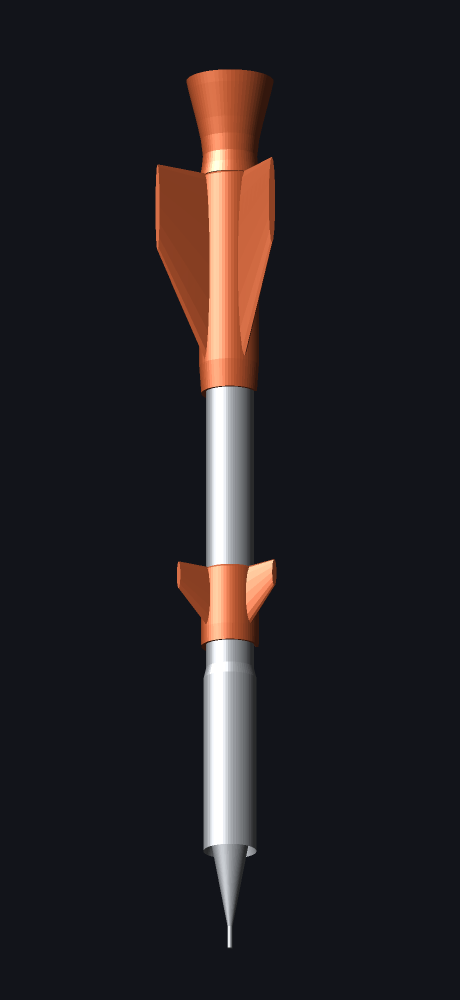

# グラフギア1000 ロケット化キット

ぺんてる グラフギア1000（PG1013/1014/1015/1017/1019）に後付けして、
ペンをロケットの見た目にする外装パーツ3点。見た目重視のおまけ。



ペン先＝ノーズコーン、後端＝エンジンノズル。書くと下から芯（＝噴射炎）が出る、という向き。

## パーツ

| ファイル | 何 | 取り付け位置（ペン先=0mm） | サイズ |
|---|---|---|---|
| `stl/canard_ring.stl` | カナード（小翼3枚）＋割りリング | 56〜70mm | 全幅 22.4mm |
| `stl/fin_ring.stl` | メインフィン（後退翼3枚）＋割りリング | 103〜143mm | 全幅 31.6mm |
| `stl/engine_bell.stl` | エンジンノズル（ノックにかぶせる） | 143〜161mm | 外径 15.6mm |

- リング2点は**割りリング（Cクリップ）**。軸（φ8.5）に横からパチンとはめる。
- ノズルはノック（φ6.5）に圧入。**押せばそのままノックできる**＝点火ボタン。
- 装着すると全長 150mm → **161mm** になる。

### クリップを潰さないこと

グラフギア1000は**クリップを開くとペン先が収納される**機構なので、
リングにはクリップ逃げのスリットが入っている（メイン110°／カナード60°）。
**スリットをクリップ側に向けて**はめること。逆向きだとペン先収納が使えなくなる。

## 作り直す

```bash
python3 rocket_addon.py            # ./stl/ に出力
python3 rocket_addon.py out --mock # 本体ダミー付き（合わせ確認用）
```

外部ライブラリなし。寸法はすべて `rocket_addon.py` 冒頭の `PEN` / `BELL` / `FIN` /
`CANARD` にまとまっているので、そこを直せば全体が追従する。
生成時に各パーツが閉じた立体になっているか（穴あきメッシュでないか）を検査して
`OK` と表示する。

よく触るところ:

- `FIT` … 軸への締めしろ。**ゆるい→増やす／入らない→減らす**（プリンタの誤差ぶん）
- `PEN['clip_az']` … クリップの向き。スリットの位置が回る
- `FIN['span']`, `FIN['n']` … フィンの張り出しと枚数
- `SEG` … 円周の分割数。上げると滑らか＆ファイルは重くなる

## 印刷

- PLA / 積層 0.15〜0.2mm / 外周3本 / 充填 20%
- **軸を垂直**に置く（ペン先が下）と、フィンの後退角がゆるいオーバーハングになり
  サポートなしで通る。ノズルは口を下向きに置くとサポート不要
- 割りリングは薄い（肉厚 約1.3mm）ので、ABS より PLA / PETG が安全

## 寸法の出典

カタログにある値:

| 項目 | 値 | 出典 |
|---|---|---|
| 全長 | 150mm（海外表記では149mm） | [モノタロウ PG1015](https://www.monotaro.com/p/2413/9343/) / [Dave's Mechanical Pencils](http://davesmechanicalpencils.blogspot.com/2006/12/pentel-graphgear-1000-pg1015-mechanical.html) / [ipenstore](https://ipenstore.com/products/pentel-graphgear-1000-mechanical-pencil-0-5-mm-1) |
| 外寸 | 10 × 9 × 150mm | [モノタロウ](https://www.monotaro.com/p/2413/9343/) |
| 軸径 | 8.5mm | [ipenstore](https://ipenstore.com/products/pentel-graphgear-1000-mechanical-pencil-0-5-mm-1) |
| グリップ径 | 9.5mm（最大10mm） | [ipenstore](https://ipenstore.com/products/pentel-graphgear-1000-mechanical-pencil-0-5-mm-1) / [Dave's](http://davesmechanicalpencils.blogspot.com/2006/12/pentel-graphgear-1000-pg1015-mechanical.html) |
| 重さ | 20g | [モノタロウ](https://www.monotaro.com/p/2413/9343/) |
| 先端ガイドパイプ | 4mm 固定スリーブ・収納式 | [ぺんてる公式](https://www.pentel.co.jp/products/mechanicalpencil/graphgear1000/) |
| 重心 | ペン先から約80mm | [Dave's](http://davesmechanicalpencils.blogspot.com/2006/12/pentel-graphgear-1000-pg1015-mechanical.html) |
| 材質 | 軸=アルミ／ノック=ステンレス／クリップ=鉄／先金=真鍮／グリップ=シリコンゴム＋真鍮 | [モノタロウ](https://www.monotaro.com/p/2413/9343/) |
| 芯径 | 0.3 / 0.4 / 0.5 / 0.7 / 0.9mm（PG1013〜1019・本体は共通） | [ぺんてる公式](https://www.pentel.co.jp/products/mechanicalpencil/graphgear1000/) |

カタログに無いので**推定**した値（`rocket_addon.py` の `PEN` にコメント付きでまとめてある）:

- グリップ区間 18〜50mm、先金が軸径に達する位置 22mm
- クリップの位置と幅
- ノック径 φ6.5・突き出し 143〜150mm

この4つは実物をノギスで測って直すと、はめ合いがきれいに出る。
