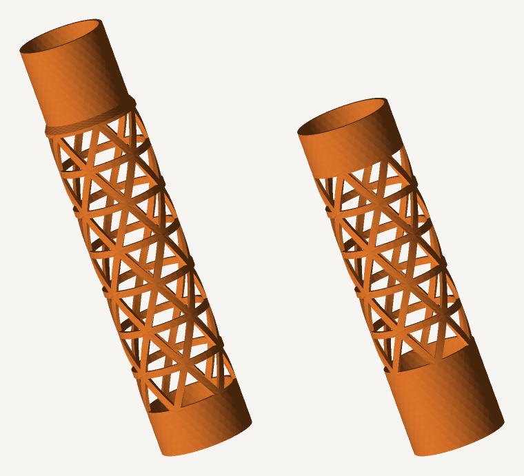

# リレーバトン 3Dモデル（材料最小・三角ラティス構造）


筒の壁を三角形の枠（トラス）に置きかえて、**材料を約半分**にしたリレーバトン。
寸法は陸上競技規則（長さ28〜30cm／周囲12〜13cm）に合わせてあります。

STLはパラメトリックに生成しています。`baton.py` を走らせれば、太さ・肉厚・
穴の大きさを変えた自分用のバトンをすぐ作りなおせます。

## できあがり

| | 1本もの | 分割版A（差しこみ側） | 分割版B（受け側） |
|---|---|---|---|
| ファイル | `stl/relay-baton-1piece.stl` | `stl/relay-baton-split-a.stl` | `stl/relay-baton-split-b.stl` |
| 造形サイズ | 38.5 × 38.5 × **280** mm | 38.5 × 38.5 × **175** mm | 38.5 × 38.5 × **140** mm |
| 材料 | 23.1 cm³ / PLA約 **28.7 g** | 16.8 cm³ / 約20.8 g | 14.8 cm³ / 約18.3 g |
| フィラメント | 約9.6 m | 約7.0 m | 約6.1 m |

- **穴なしの中空円筒（同じ肉厚）なら 45.7 cm³ = 約57 g** なので、**約49%の削減**。
  中実の棒（約405g）とくらべれば93%減です。
- 分割版は2本合わせて約39g。継手のぶんだけ重くなりますが、
  **造形高さ175mmまで**なので一般的なFDMプリンタ（Z=200〜250mm）でも印刷できます。
  1本もの版は造形高さ285mm以上のプリンタが必要です。



## 寸法・構造

| 項目 | 値 | 根拠 |
|---|---|---|
| 全長 | 280 mm | 規則は28〜30cm。最短にして材料を節約 |
| 外径 | 38.5 mm | 周囲121mm（規則は12〜13cm） |
| 肉厚 | 1.4 mm | ノズル0.4mmの外壁3〜4本ぶん。インフィル0%で中身なし |
| リブ幅 | 約2.9 mm | 三角ラティスの桟。開口率56% |
| 端の帯 | 両端17.5 mm | 握りとフチの保護のため穴なし（口が欠けない） |

材料を減らす手は3つ重ねています。

1. **中空にする** — 棒ではなく筒。ここで9割以上減る。
2. **壁を薄くする** — 1.4mm。曲げに効くのは外側の材料なので、外径を保ったまま薄くする。
3. **壁に穴をあける** — 残りをさらに半減。ただし**三角形**の枠で抜く。
   三角形は変形しにくく（トラス構造）、四角い格子のように平行四辺形につぶれません。
   バトンが受けるのは主に「握りつぶす力」と「落としたときの曲げ」なので、
   斜めの桟が通っている三角ラティスが効きます。

## 印刷設定（FDM／PLA・PETG）

- **向き**: 立てて（長さ方向をZ軸に）。付属STLはその向きで出力済み。
- **サポート**: 不要。穴の上辺は最長10mm程度のブリッジで、そのまま架かります。
- **壁の数**: 5本以上／**インフィル0%／トップ・ボトム0層**。
  肉厚1.4mmなので全部が外壁になり、いちばん密で丈夫かつ最速です。
- **層厚**: 0.2mm
- **ブリム**: あり（接地面積が小さいので5mm程度つけると安心）
- **材料**: 落として割りたくなければ PETG か PLA+。PLAは軽いが欠けやすい。

分割版の組み立て:
片方の差しこみ部（外径35.2mm／長さ32mm）をもう片方の口に差しこむだけ。
すきまは直径で0.5mmとってあります。ゆるければテープを一巻き、
本番用にするなら瞬間接着剤かエポキシで固定してください。
継手は穴なしの筒なので、いちばん力のかかる中央部がそのまま補強になります。

## 自分用に作りなおす

Python 3 だけで動きます（外部ライブラリなし）。

```bash
python3 baton.py                      # 既定（軽量版）
python3 baton.py --preset legal       # 公式規格の重量を満たす版（約56g）
python3 baton.py --hole 0.82          # 穴を大きくしてさらに軽く（約23g）
python3 baton.py --od 32 --length 200 # 小学生向けに細く短く
python3 baton.py --nth 8 --bands 20   # ラティスの目を細かく
```

主なオプション

| オプション | 既定 | 意味 |
|---|---|---|
| `--od` | 38.5 | 外径 mm |
| `--wall` | 1.4 | 肉厚 mm |
| `--length` | 280 | 全長 mm |
| `--hole` | 0.75 | 穴の相似比（0〜1）。開口率は約 `hole²`。大きいほど軽く・弱い |
| `--nth` | 6 | 円周方向のセル数 |
| `--bands` | 16 | 長さ方向の段数（偶数） |
| `--m` | 6 | 1辺の分割数。大きいほど円が滑らかでファイルも大きい |

実行すると、閉じた多様体（watertight）かどうかの検査結果と、
材料の体積・重さ・フィラメント長が表示されます。

プレビュー画像も標準ライブラリだけで作れます。

```bash
python3 render.py stl/relay-baton-1piece.stl -o preview.png
```

## 公式競技に使う場合

世界陸連／日本陸連の規則では、バトンは**重さ50g以上**・長さ28〜30cm・
周囲12〜13cm・**なめらかな中空の管**と決められています。
軽量版（約29g）は**練習用**です。試合で使うなら

```bash
python3 baton.py --preset legal
```

で肉厚2.2mm・開口率44%の版（約56g）を出力してください。
なお「なめらかな管」の解釈次第では穴あき自体が認められないこともあるので、
公式戦では主催者の確認をとってください。

## しくみ（`baton.py`）

筒の壁を「角度θ × 高さz」の平面に展開し、正三角形に近い三角形で敷きつめます。
各セルは、そのまま埋める（両端・継手）か、内側に相似な三角形の穴をあけて
枠だけ残す（中央部）かのどちらか。この2Dメッシュを半径方向に押し出すと
穴あき円筒になります。押し出す半径は高さ方向のレベルごとに変えられるので、
分割版の段差（スピゴット）も同じしくみで作っています。

隣りあうセルは辺の分割数が同じなので頂点が必ず一致し、出力は常に
閉じた向きづけ可能多様体になります。書き出し前に

- 各有向辺がちょうど1回、その逆向きもちょうど1回だけ現れるか
- 符号つき体積が正か（法線が外を向いているか）

を検査しているので、スライサーで「修復が必要」と言われることはありません。
