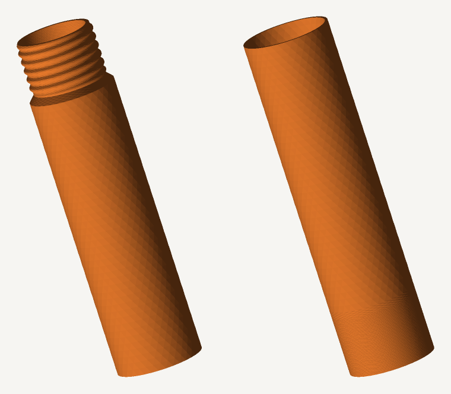
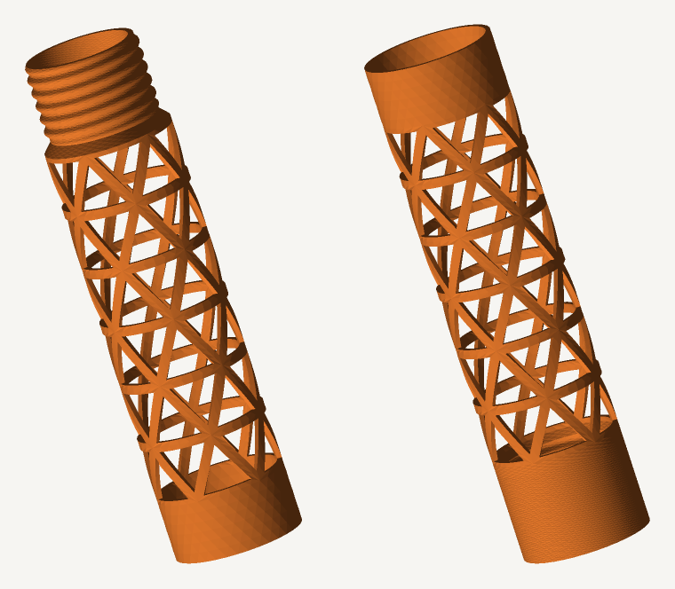

# リレーバトン 3Dモデル（ねじ式2分割・Bambu Lab A1 mini 対応）



3Dプリントできるリレーバトン。寸法は陸上競技規則（長さ28〜30cm／周囲12〜13cm／
重さ50g以上）に合わせ、**A1 mini の造形サイズ 180×180×180mm に収まるよう2分割**
してあります。継手は**ねじ込み式**なので、走っている最中に抜けません。

STLはパラメトリック生成です。`baton.py` を走らせれば太さ・長さ・肉厚・ねじのすきまを
変えた自分用のバトンをすぐ作りなおせます。

## 印刷するファイル

**筒そのまま版（おすすめ）** — `stl/baton-plain-a.stl` ＋ `stl/baton-plain-b.stl`

| | A（おねじ側） | B（めねじ側） | 組み立て後 |
|---|---|---|---|
| 造形サイズ | 38.5 × 38.5 × **153.5** mm | 38.5 × 38.5 × **153.5** mm | 全長280mm |
| 材料 | 23.1 cm³ / PLA約 28.6 g | 24.3 cm³ / PLA約 30.2 g | 約 **58.8 g** |
| フィラメント | 約9.6 m | 約10.1 m | 約19.7 m |

A・Bとも153.5mm。A1 miniの180mmに対して26mmの余裕があります。
重さ約59gなので、**公式規則の50g以上もそのまま満たします**。

**軽量ラティス版** — `stl/baton-lattice-a.stl` ＋ `stl/baton-lattice-b.stl`



筒の壁を三角形の枠に抜いた版。造形サイズは同じ153.5mmで、**合計41.5g**（約29%軽い）。
50gを下回るので練習用です。三角形は平行四辺形につぶれないので、
四角い格子と違って握力にも落下時の曲げにも耐えます。

## ねじ継手

| 項目 | 値 |
|---|---|
| ねじ | 右ねじ・台形／呼び径34.8mm・**ピッチ4mm** |
| かみ合い | 長さ24mm ＝ **6回転**。ねじ込むと段差が突きあたって止まる |
| 山の高さ | 1.0mm（かみ合い0.75mm） |
| すきま | 半径で0.25mm（`--fit` で調整可） |
| 継手の肉厚 | 溝の底でも1.6mm |

山の斜面は軸に対して40°なので、**立てて刷ればサポートなしでそのまま出ます**。
オスの先端と根元は山を消してあるので、ねじ始めが引っかかりません。

**まず試し刷りを**（5分・約20g）。プリンタによってすきまの出かたが違うので、
短い継手だけの版で確かめてから本番を刷るのが確実です。

```bash
python3 baton.py --preset plain --length 60 --only split --name thread-test
```

きつくて回らなければ `--fit 0.35`、ゆるすぎれば `--fit 0.15` で作りなおしてください。

## 寸法

| 項目 | 値 | 根拠 |
|---|---|---|
| 全長 | 280 mm | 規則は28〜30cm。最短にして材料を節約 |
| 外径 | 38.5 mm | 周囲121mm（規則は12〜13cm） |
| 肉厚 | 1.2 mm | 0.4mmノズルで壁3本ぶん。インフィル0%で中身なし |

材料を減らす手は2つ。**中空にする**（中実の棒なら約405g）ことで9割以上減り、
さらに**壁を1.2mmまで薄くする**。曲げに効くのは外側の材料なので、
外径を保ったまま薄くすれば強さをあまり落とさずに軽くできます。

## 印刷設定（A1 mini / PLA・PETG）

- **向き**: 立てたまま。STLはその向きで出力済みなので、置いてスライスするだけ。
  A・Bを並べて一度に刷れます。
- **サポート**: 不要（ねじ山も、ラティスの穴も自力で架かります）。
- **壁の数**: 8本／**インフィル0%／トップ・ボトム0層**。
  筒の部分（1.2mm）は全部が外壁になり、継手の厚い部分はみっちり詰まります。
- **層厚**: 0.2mm（ねじをきれいに出すなら0.15mm）
- **ブリム**: 5mm程度（接地面積が小さいので保険に）
- **材料**: 落として割りたくなければ PETG か PLA+。PLAは軽いが欠けやすい。

**組み立て**: AをBにねじ込むだけ。6回転で段差が突きあたって止まります。
外れなくしたいときは、最後の1回転の手前でねじ山に瞬間接着剤を少量。

## 自分用に作りなおす

Python 3 だけで動きます（外部ライブラリなし）。

```bash
python3 baton.py --preset plain --only split --name baton-plain     # 筒そのまま版
python3 baton.py --preset light --only split --name baton-lattice   # ラティス版
python3 baton.py --preset plain --fit 0.35                          # ねじをゆるめに
python3 baton.py --preset plain --wall 1.0                          # さらに薄く
python3 baton.py --od 32 --length 200 --plain                       # 小学生向けに細く短く
python3 baton.py --max-height 250                                   # 大きいプリンタ向け
python3 baton.py --preset plain --only one                          # 1本もの（継手なし）
```

主なオプション

| オプション | 既定 | 意味 |
|---|---|---|
| `--preset` | `light` | `plain`＝穴なしの筒／`light`＝軽量ラティス／`legal`＝公式規格重量 |
| `--plain` / `--lattice` | — | 穴のあり・なしを個別に切りかえる |
| `--fit` | 0.25 | ねじのすきま mm。きつければ増やす |
| `--no-thread` | — | ねじをやめてただ差しこむだけの継手にする |
| `--od` | 38.5 | 外径 mm |
| `--wall` | 1.2〜1.4 | 肉厚 mm |
| `--length` | 280 | 全長 mm。短くすれば継手の試し刷りにもなる |
| `--hole` | 0.75 | ラティスの穴の相似比（0〜1）。開口率は約 `hole²` |
| `--max-height` | 180 | プリンタの造形高さ。各パーツが収まるか判定して表示する |
| `--only` | 両方 | `split`＝分割版だけ／`one`＝1本ものだけ |
| `--name` | `relay-baton` | 出力ファイル名の頭 |

分割位置はA・Bの造形高さがそろうところに自動で決まります。

実行すると、閉じた多様体（watertight）かどうかの検査結果、材料の体積・重さ・
フィラメント長、造形高さがプリンタに収まるかが表示されます。

プレビュー画像も標準ライブラリだけで作れます。

```bash
python3 render.py stl/baton-plain-a.stl stl/baton-plain-b.stl -o preview.png
```

## 公式競技に使う場合

世界陸連／日本陸連の規則では、バトンは重さ50g以上・長さ28〜30cm・周囲12〜13cm・
なめらかな中空の管と決められています。**筒そのまま版（約59g）はこれを満たします**。
ラティス版（41.5g）は重さが足りず、「なめらかな管」の解釈上も穴あきが認められない
可能性があるので練習用と考えてください。もっと重い版が要るときは
`python3 baton.py --preset legal`（肉厚2.2mm・ラティス版）もあります。

## しくみ（`baton.py`）

筒の壁を「角度θ × 高さz」の平面に展開し、正三角形に近い三角形で敷きつめます。
各セルは、そのまま埋める（筒そのまま版・両端・継手）か、内側に相似な三角形の穴を
あけて枠だけ残す（ラティス版の中央部）かのどちらか。この2Dメッシュを半径方向に
押し出すと筒になります。

**ねじも同じしくみです**。押し出す半径を高さzだけでなく角度θの関数にすると、
らせん状の山ができます。オスは `谷 + 山の高さ × 断面(位相)`、メスは同じ断面ぶんだけ
内側を削るので、必ずかみ合います。位相は `z/ピッチ − θ/2π` で、これが一定になる
ところが山の稜線です。メッシュのつなぎ方は変えていないので、ねじを刻んでも
閉じた立体のままです。

隣りあうセルは辺の分割数が同じなので頂点が必ず一致し、出力は常に閉じた
向きづけ可能多様体になります。書き出し前に

- 各有向辺がちょうど1回、その逆向きもちょうど1回だけ現れるか
- 符号つき体積が正か（法線が外を向いているか）

を検査しているので、スライサーで「修復が必要」と言われることはありません。
